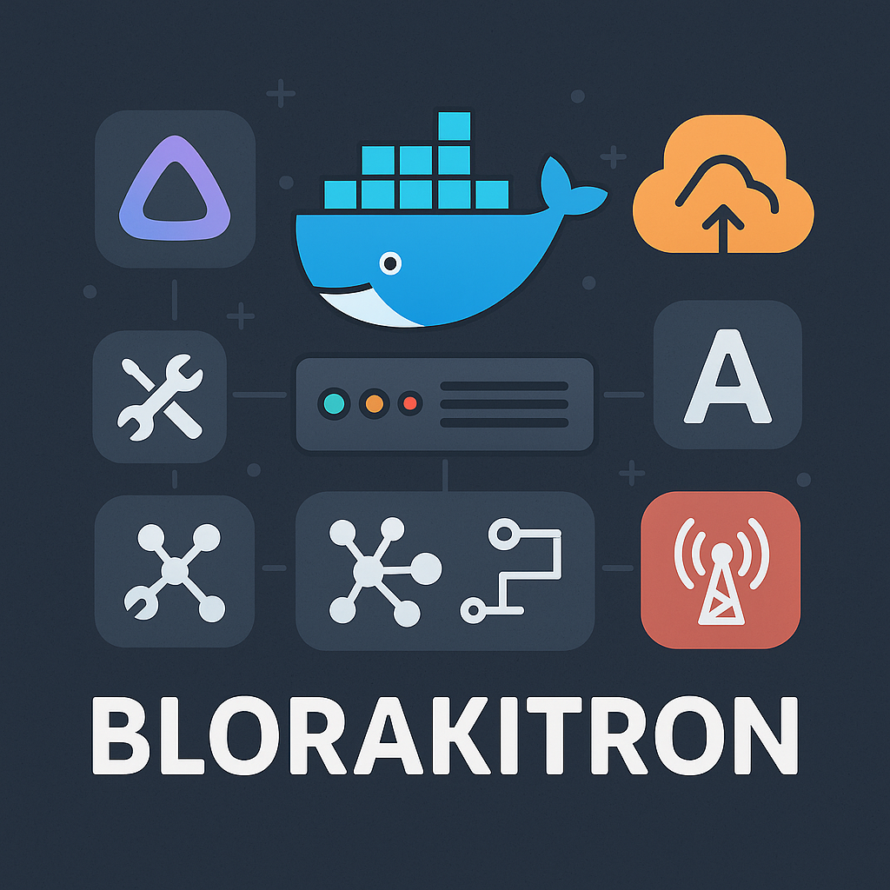

# 🤖 Blorakitron – Self-Hosted Service Stack with Docker



**Blorakitron** is a modular and extensible self-hosted service stack built using Docker and `docker-compose`. It integrates multiple services for media management, downloading, secure access, and future utilities like web hosting, dashboards, and more.

---

## 🔧 Core Features

- 🔌 Docker-based orchestration
- 🧩 Modular and extensible by design
- 🎞️ Media downloading and streaming
- 🌐 Secure remote access via Cloudflared
- ⚙️ Future support for web servers, dashboards, and system monitoring

---

## 📦 Included Services (So Far)

| Service        | Description                                                                  |
|----------------|------------------------------------------------------------------------------|
| **Jellyfin**    | Media streaming server for music, movies, and TV shows                      |
| **Sonarr**      | Automated TV show downloader                                                 |
| **Radarr**      | Automated movie downloader                                                   |
| **Transmission**| Lightweight BitTorrent client with web UI                                   |
| **Jackett**     | Torrent indexer aggregator for Sonarr/Radarr                                |
| **Cloudflared** | Expose local services securely over the internet using Cloudflare Tunnel    |
| *(Coming Soon)* **Apache** | Web server for dashboards, static content, and reverse proxying |

---

## 🚀 Getting Started

### 1. Clone the Repository

```bash
git clone https://github.com/yourusername/blorakitron.git
cd blorakitron
```

### 2. Set Up Environment Variables (Optional)

```bash
cp .env.example .env
# Modify to match your preferred paths and ports
```

### 3. Launch the Stack

```bash
docker-compose up -d
```

---

## 🌍 Accessing the Services

| Service        | Default URL                         |
|----------------|-------------------------------------|
| Jellyfin       | http://localhost:8096               |
| Sonarr         | http://localhost:8989               |
| Radarr         | http://localhost:7878               |
| Transmission   | http://localhost:9091               |
| Jackett        | http://localhost:9117               |
| Cloudflared    | Access via public tunnel URL        |

---

## 📁 Project Structure

```
blorakitron/
├── docker-compose.yml
├── .env.example
├── configs/
│   └── service-specific configs
├── data/
│   └── media, downloads, etc.
├── assets/
│   └── blorakitron-banner.png
└── README.md
```

## 🧪 Contributing

PRs and suggestions are welcome! If you have ideas for services or improvements, feel free to open an issue.

---

## 📜 License

This work is licensed under the Creative Commons Attribution-NonCommercial 4.0 International License.

See [](http://creativecommons.org/licenses/by-nc/4.0/)
file for details.